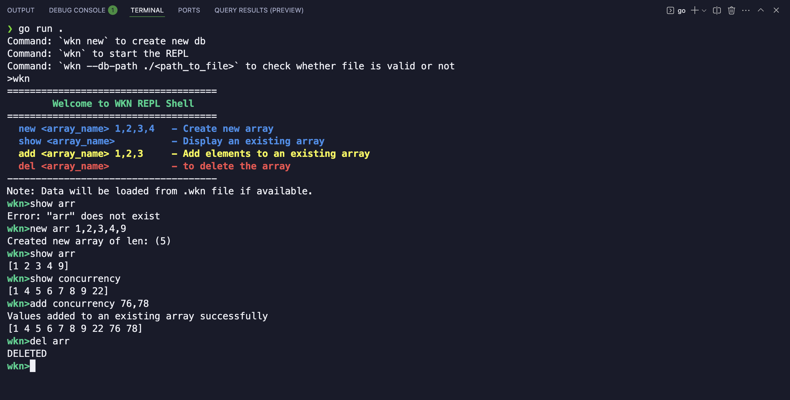

REPL - Read, Eval, Print, Loop

## Shell based REPL db built using Go Lang

It uses a single file to store everything, the goal is to have persistent data. The database can
support list data as of now and can perform some operations on them

1. https://www.digitalocean.com/community/tutorials/what-is-repl
